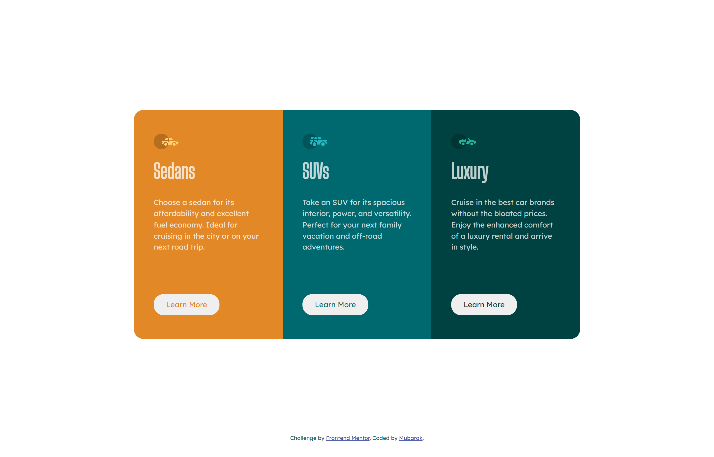

# Frontend Mentor - 3-column preview card component solution

## Table of contents

- [Overview](#overview)
  - [The challenge](#the-challenge)
  - [Screenshot](#screenshot)
  - [Links](#links)
- [My process](#my-process)
  - [Built with](#built-with)
  - [What I learned](#what-i-learned)
  - [Useful resources](#useful-resources)
- [Author](#author)

## Overview

This is a solution to the [3-column preview card component challenge on Frontend Mentor](https://www.frontendmentor.io/challenges/3column-preview-card-component-pH92eAR2-). Frontend Mentor challenges help you improve your coding skills by building realistic projects. 

### The challenge

Users should be able to:

- View the optimal layout depending on their device's screen size
- See hover states for interactive elements

### Screenshot




### Links

- Solution URL: [solution](https://github.com/Freedteck/3-column-preview-card-component)
- Live Site URL: [Live site](https://freedteck.github.io/3-column-preview-card-component/)

## My process

### Built with

- Semantic HTML5 markup
- CSS custom properties
- Flexbox
- Mobile-first workflow
- [Bootstrap](https://getbootstrap.com/) - CSS library

### What I learned

I learnt the power of overflow: ```overflow: hidden; ```, min-height and max-width

```css
#content {
    border-radius: 20px;
    overflow: hidden;
    max-width: 900px;
}
```

## Author

- Frontend Mentor - [@Freedteck](https://www.frontendmentor.io/profile/Freedteck)